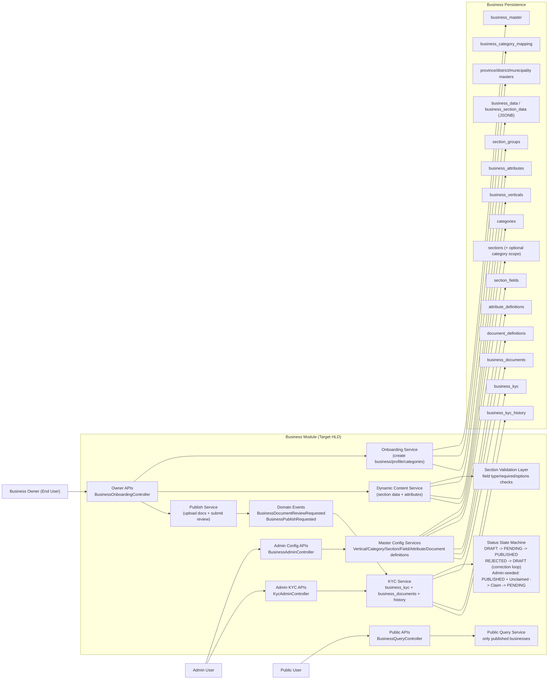

```mermaid
flowchart LR
  A["Business Owner (End User)"] --> B["Owner APIs\nBusinessOnboardingController"]
  P["Public User"] --> Q["Public APIs\nBusinessQueryController"]
  AD["Admin User"] --> C["Admin Config APIs\nBusinessAdminController"]
  AD --> KAD["Admin KYC APIs\nKycAdminController"]

  subgraph Business_Module["Business Module (Target HLD)"]
    B --> S1["Onboarding Service\n(create business/profile/categories)"]
    B --> S2["Dynamic Content Service\n(section data + attributes)"]
    B --> S3["Publish Service\n(upload docs + submit review)"]

    C --> D1["Master Config Services\nVertical/Category/Section/Field/Attribute/Document definitions"]

    Q --> S4["Public Query Service\nonly published businesses"]

    S2 --> V["Section Validation Layer\nfield type/required/options checks"]

    S3 --> EVT["Domain Events\nBusinessDocumentReviewRequested\nBusinessPublishRequested"]
    EVT --> KYC["KYC Service\nbusiness_kyc + business_documents + history"]

    KAD --> KYC
    KYC --> ST["Status State Machine\nDRAFT -> PENDING -> PUBLISHED\nREJECTED -> DRAFT (correction loop)\nAdmin-seeded: PUBLISHED + Unclaimed -> Claim -> PENDING"]
  end

  subgraph DB["Business Persistence"]
    T1["business_master"]
    T2["business_verticals"]
    T3["categories"]
    T4["business_category_mapping"]
    T5["sections (+ optional category scope)"]
    T6["section_fields"]
    T7["business_data / business_section_data (JSONB)"]
    T8["section_groups"]
    T9["attribute_definitions"]
    T10["business_attributes"]
    T11["document_definitions"]
    T12["business_documents"]
    T13["business_kyc"]
    T14["business_kyc_history"]
    T15["province/district/municipality masters"]
  end

  S1 --> T1
  D1 --> T2
  D1 --> T3
  D1 --> T5
  D1 --> T6
  D1 --> T9
  D1 --> T11
  S1 --> T4
  S2 --> T7
  S2 --> T8
  S2 --> T10
  KYC --> T12
  KYC --> T13
  KYC --> T14
  S1 --> T15

```