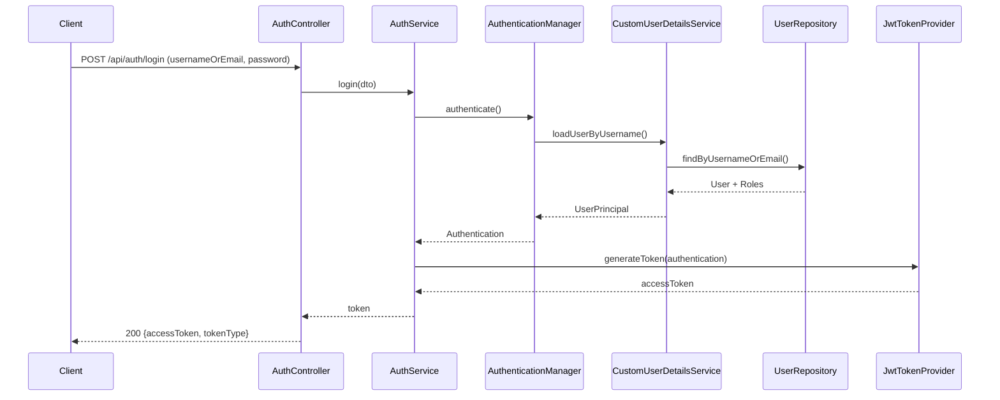

# Login Flow Sequence

```mermaid
sequenceDiagram
    participant Client
    participant AuthController
    participant AuthService
    participant AuthManager as AuthenticationManager
    participant UserDetails as CustomUserDetailsService
    participant Repo as UserRepository
    participant JWT as JwtTokenProvider

    Client->>AuthController: POST /api/auth/login (usernameOrEmail, password)
    AuthController->>AuthService: login(dto)
    AuthService->>AuthManager: authenticate()
    AuthManager->>UserDetails: loadUserByUsername()
    UserDetails->>Repo: findByUsernameOrEmail()
    Repo-->>UserDetails: User + Roles
    UserDetails-->>AuthManager: UserPrincipal
    AuthManager-->>AuthService: Authentication
    AuthService->>JWT: generateToken(authentication)
    JWT-->>AuthService: accessToken
    AuthService-->>AuthController: token
    AuthController-->>Client: 200 {accessToken, tokenType}
```
