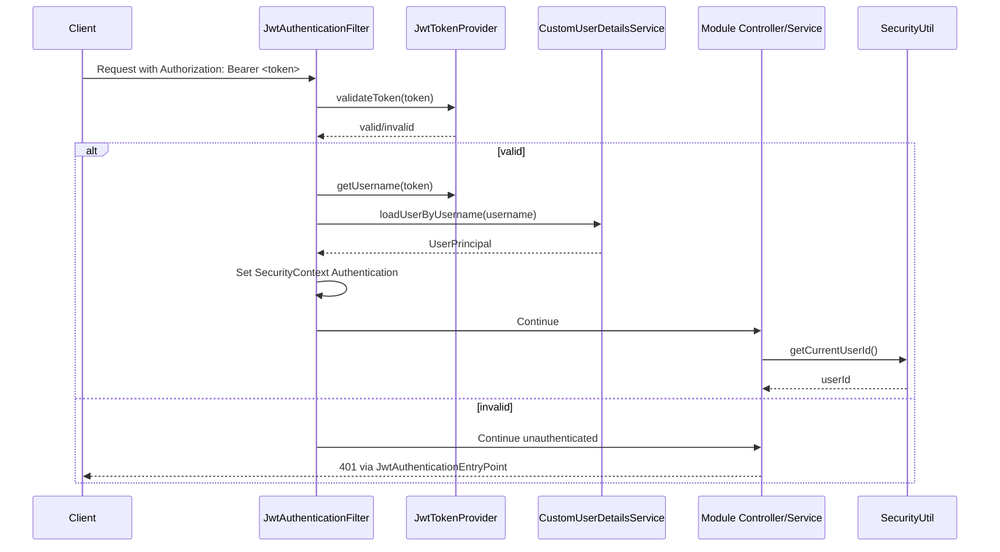

# Protected API Flow Sequence

```mermaid
sequenceDiagram
    participant Client
    participant Filter as JwtAuthenticationFilter
    participant JWT as JwtTokenProvider
    participant UserDetails as CustomUserDetailsService
    participant API as Module Controller/Service
    participant Sec as SecurityUtil

    Client->>Filter: Request with Authorization: Bearer <token>
    Filter->>JWT: validateToken(token)
    JWT-->>Filter: valid/invalid
    alt valid
        Filter->>JWT: getUsername(token)
        Filter->>UserDetails: loadUserByUsername(username)
        UserDetails-->>Filter: UserPrincipal
        Filter->>Filter: Set SecurityContext Authentication
        Filter->>API: Continue
        API->>Sec: getCurrentUserId()
        Sec-->>API: userId
    else invalid
        Filter->>API: Continue unauthenticated
        API-->>Client: 401 via JwtAuthenticationEntryPoint
    end
```
